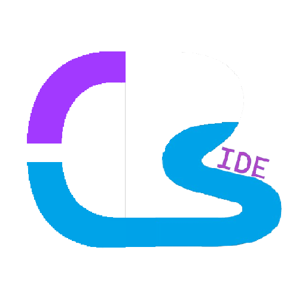

<picture>
  <source media="(prefers-color-scheme: dark)" srcset="./App/Resources/Images/CodePenStudio_White.png" style = "width: 20%; height: auto;">
  <source media="(prefers-color-scheme: light)" srcset="./App/Resources/Images/CodePenStudio_Black.png" style = "width: 20%; height: auto;">
  
</picture>

# CodePen-Studio · 代码之笔
<strong> An open-source IDE with native runtime based on C++/OpenGL. </strong>

<em>Chinese name: <strong>代码之笔</strong> (official Chinese branding). The repository name remain <code>CodePen-Studio</code>.</em>

[中文](./README-zh.md)

### Where code reaches, an echo returns
#### With the pen of creation, light up the digital beyond

## Runtime Screenshot

<em> A screenshot of the IDE's actual running interface during <code>compilation</code> </em>

<!-- ## What CodePen-Studio Is -->

## License

CodePen-Studio is released under the Apache License. See [`LICENSE`](./LICENSE) file for details.
